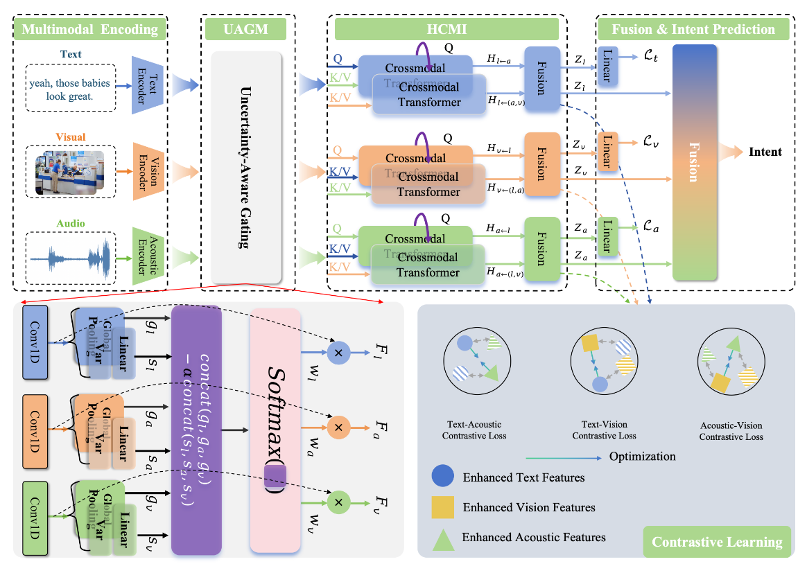

# DUMIR：Dynamic Uncertainty-Aware Multimodal Intent Recognition

---

## Introduction

In real-world multimodal interactions, humans infer intents by jointly considering textual semantics, vocal expressions, and visual behaviors. However, most existing multimodal intent recognition methods overlook the fact that the reliability of non-textual modalities may vary significantly across samples and typically employ fixed fusion strategies, making them susceptible to noisy or unreliable signals. Furthermore, current methods remain highly dependent on textual semantics. To address these challenges, we propose DUMIR, which dynamically models modality reliability and adaptively calibrates modality contributions for robust multimodal intent recognition.

## Overall Architecture

The overview model architecture:



Figure 2: Overall architecture of the proposed DUMIR framework, including the Uncertainty-Aware Gating
Module (UAGM), the Hierarchical Cross-Modal Interaction Module (HCMI), and the multi-task optimization
strategy.

## Quick start

1. Use anaconda to create Python (version >=3.6) environment

```
conda create --name DUMIR python=3.9
conda activate DUMIR
```

2. Install related environmental dependencies

```
pip install -r requirements.txt
```

3. Prepare the datasets

Place MIntRec and MIntRec2.0 under `datasets/MIntRec` and
`datasets/MIntRec2.0`, respectively, or provide the dataset root through
`--data_path` or the `MINTREC_DATA_PATH` environment variable. Pre-trained
BERT models are loaded by model name by default; `--bert_path` can be used as
a prefix for local checkpoints.

4. Run examples

- MIntRec

```
sh examples/run_dumir_bert_MIntRec.sh
```

- MIntRec2.0

```
sh examples/run_dumir_bert_MIntRec2.sh
```
